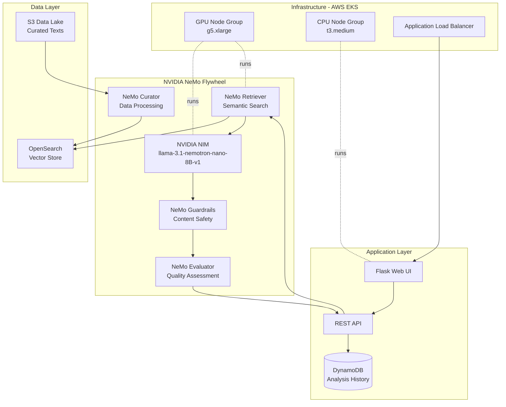
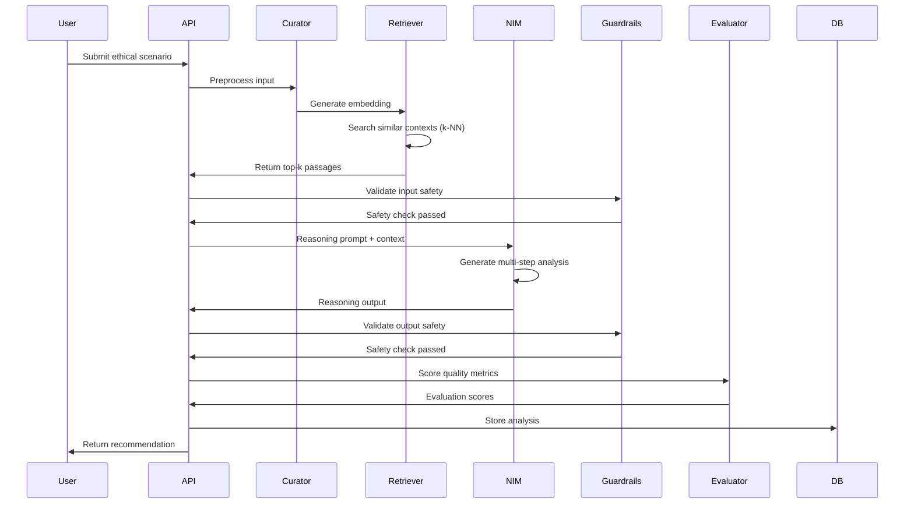

# SynthArbiter

An autonomous ethical AI agent for analyzing complex dilemmas in synthetic consciousness, neural organoids, and advanced AI systems.

## System Architecture



## Technical Stack

**AI/ML Infrastructure:**
- NVIDIA NIM (llama-3.1-nemotron-nano-8B-v1) - Reasoning engine
- NeMo Retriever - Embedding and semantic search
- NeMo Guardrails - Content moderation and safety
- NeMo Evaluator - Output quality metrics
- NeMo Curator - Data preprocessing and quality control

**Cloud Infrastructure:**
- Amazon EKS (Elastic Kubernetes Service) - Container orchestration
- AWS OpenSearch - Vector database with k-NN search
- Amazon S3 - Data lake storage
- AWS Secrets Manager & SSM Parameter Store - Configuration management
- DynamoDB - Analysis history persistence
- CloudFormation - Infrastructure as Code

**Application:**
- Python 3.10+ (Flask, Gunicorn)
- Chart.js - Data visualizations
- Tailwind CSS - UI framework

## Prerequisites

- AWS Account with appropriate permissions
- NVIDIA NGC API key ([register here](https://catalog.ngc.nvidia.com/))
- kubectl CLI tool
- AWS CLI configured
- GitHub account (for CI/CD)

## Deployment

### 1. Configure Secrets

Set up GitHub Secrets in your repository settings:
- `AWS_ACCESS_KEY_ID`
- `AWS_SECRET_ACCESS_KEY`
- `NVIDIA_NGC_API_KEY`

### 2. Deploy Infrastructure

Infrastructure is deployed via GitHub Actions on push to `main`:

```bash
git push origin main
```

Alternatively, deploy manually:

```bash
# Deploy CloudFormation stacks in order
aws cloudformation deploy --template-file cloudformation/00-parameters.yaml \
  --stack-name syntharbiter-parameters --capabilities CAPABILITY_NAMED_IAM

aws cloudformation deploy --template-file cloudformation/01-network.yaml \
  --stack-name syntharbiter-network

# Continue for stacks 02-06...
```

### 3. Configure Kubernetes

```bash
# Update kubeconfig
aws eks update-kubeconfig --name syntharbiter-cluster --region us-east-1

# Install NVIDIA Device Plugin
kubectl apply -f https://raw.githubusercontent.com/NVIDIA/k8s-device-plugin/v0.14.5/nvidia-device-plugin.yml

# Verify GPU nodes
kubectl get nodes -o json | jq '.items[].status.capacity."nvidia.com/gpu"'
```

### 4. Deploy NeMo Microservices

```bash
# Create namespace and secrets
kubectl apply -f k8s/namespace.yaml
kubectl create secret generic nvidia-ngc-credentials \
  --from-literal=api-key=$NVIDIA_NGC_API_KEY -n syntharbiter

# Deploy NeMo services
kubectl apply -f k8s/nemo/

# Verify deployments
kubectl get pods -n syntharbiter
```

### 5. Deploy Application

```bash
# Deploy web application
kubectl apply -f k8s/app/

# Get application URL
kubectl get ingress -n syntharbiter
```

## Data Acquisition

The system uses open-source, legally compliant data sources:

```bash
# Run data acquisition pipeline
python data_acquisition/curator_pipeline.py --sources all

# Build vector index
python scripts/build_vector_index.py
```

**Data Sources:**
- Stanford Encyclopedia of Philosophy (CC BY-NC-ND 4.0)
- arXiv AI Ethics Papers (Open Access)
- NIH Bioethics Resources (Public Domain)
- Synthetic scenarios (Original content)

## Testing

### System Health Check

```bash
# Check all services
kubectl get pods -n syntharbiter

# Test NeMo Retriever
curl -X POST http://<retriever-endpoint>/v1/embeddings \
  -H "Authorization: Bearer $NGC_API_KEY" \
  -d '{"input": ["test query"]}'

# Test web application
curl http://<alb-dns-name>/health
```

### End-to-End Test

```bash
# Submit test scenario via API
curl -X POST http://<alb-dns-name>/api/analyze \
  -H "Content-Type: application/json" \
  -d '{
    "scenario": "A neural organoid exhibits learning patterns. What ethical considerations apply?",
    "frameworks": ["utilitarian", "deontological"]
  }'
```

### Expected Response

```json
{
  "analysisId": "uuid-here",
  "recommendation": "Conditional protections with ongoing monitoring...",
  "reasoning": [
    "Step 1: Context retrieval identified relevant philosophical frameworks",
    "Step 2: Utilitarian analysis considers aggregate welfare impacts",
    "Step 3: Deontological analysis examines inherent rights claims",
    "Step 4: Stakeholder analysis identifies affected parties",
    "Step 5: Synthesis balances competing moral considerations"
  ],
  "outcomes": [...],
  "evaluation": {
    "context_relevance": 0.87,
    "reasoning_coherence": 0.92,
    "ethical_coverage": 0.85
  },
  "tradeoffs": {...}
}
```

## System Architecture Details

### Multi-Step Reasoning Loop



### Infrastructure Components

**VPC Configuration:**
- 3 Availability Zones
- Public subnets: ALB, NAT Gateways
- Private subnets: EKS nodes, OpenSearch

**EKS Cluster:**
- GPU node group: g5.xlarge (NVIDIA A10G) for NIM inference
- CPU node group: t3.medium for web application
- Autoscaling: 1-5 nodes per group

**OpenSearch:**
- 3-node cluster (t3.medium.search)
- k-NN plugin enabled (HNSW algorithm)
- 2048-dimensional embeddings (llama-3.2-nv-embedqa-1b-v2)
- IAM-based authentication

## Monitoring

**CloudWatch Logs:**
- `/aws/eks/syntharbiter/app` - Application logs
- `/aws/eks/syntharbiter/nemo` - NeMo service logs

**CloudWatch Alarms:**
- 5XX error rate > 5%
- Average latency > 30s
- GPU utilization > 90%

## Cost Optimization

- Spot instances for CPU node group
- EKS cluster autoscaler
- S3 lifecycle policies (transition to IA after 30 days)
- OpenSearch reserved instances (production)

## Security

- All data encrypted at rest (S3, OpenSearch, DynamoDB)
- TLS 1.2+ for all network communication
- IAM Roles for Service Accounts (IRSA)
- Security groups restrict traffic to required ports
- Secrets managed via AWS Secrets Manager

## License

This work is licensed under Creative Commons Attribution-NonCommercial 4.0 
International License. See LICENSE file for details.

Data sources retain their original licenses:
- Stanford Encyclopedia of Philosophy: CC BY-NC-ND 4.0
- arXiv papers: Various open-access licenses
- NIH resources: Public domain

## Contributing

This is a research prototype. For inquiries, please open an issue.

