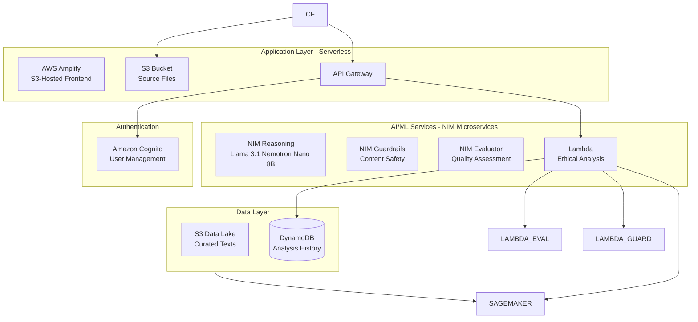

# SynthArbiter

An autonomous ethical AI agent for analyzing complex dilemmas in synthetic consciousness, neural organoids, and advanced AI systems.

## System Architecture



## Technical Stack

**AI/ML Infrastructure:**
- **NVIDIA NIM Microservices** - Production-grade AI models on SageMaker
  - NIM Reasoning (Llama 3.1 Nemotron Nano 8B)
  - NIM Guardrails (Content Safety)
  - NIM Evaluator (Quality Assessment)
- **AWS Lambda** - Analysis orchestration and API handling
- **SageMaker Endpoints** - Persistent GPU instances for NIM microservices

**Cloud Infrastructure:**
- **AWS Amplify** - Frontend hosting with automated S3 deployment
- **Amazon S3** - Source files storage and data lake
- **API Gateway** - REST API management and authentication
- **AWS Lambda** - Serverless compute for all business logic
- **Amazon Cognito** - User authentication and authorization
- **DynamoDB** - Analysis history and user data persistence
- **CloudFormation** - Infrastructure as Code

**Application:**
- **Static HTML/CSS/JS** - No backend web framework needed
- Chart.js - Data visualizations
- Tailwind CSS - UI framework

## Prerequisites

- AWS Account with appropriate permissions
- AWS CLI configured with appropriate IAM role
- GitHub repository access for CI/CD deployment
- GitHub account (for CI/CD)

## Deployment

### 1. Configure AWS Credentials

Set up GitHub Secrets in your repository settings:
- `AWS_ROLE_ARN` - IAM role for GitHub Actions deployment
- `NVIDIA_NGC_API_KEY` - (Optional, for future data processing)

### 2. Deploy SynthArbiter

Deploy via consolidated GitHub Actions workflow:

1. Go to **GitHub Actions** tab
2. Select **"Deploy SynthArbiter"** workflow
3. Click **"Run workflow"**
4. Choose **environment** (dev/prod), **region**, and optionally skip parameter setup
5. Click **"Run workflow"**

The workflow automatically handles:

#### **Phase 1: Parameter Setup**
- ✅ Sync SSM parameters from `config/parameters.json`
- ✅ Create/update NGC API key in Secrets Manager
- ⏭️ Skippable with `skip_parameters: true`

#### **Phase 2: Infrastructure Deployment**
- ✅ Deploy 4 CloudFormation stacks (Network → Storage → Frontend → NIM)
- ✅ Package and upload Lambda functions to S3
- ✅ Configure Cognito authentication
- ✅ Upload static website to S3 + deploy to Amplify
- ✅ Output complete deployment URLs and resource IDs

### 3. Access Your Application

After deployment completes, the workflow will output:
- **Website URL**: Amplify app URL (automated S3 deployment)
- **API URL**: API Gateway endpoint
- **Cognito Details**: User pool configuration

### Cost Optimization Features

- **NVIDIA NIM Microservices** - Production-grade AI models for maximum hackathon points
- **SageMaker Endpoints** - Persistent GPU instances optimized for inference
- **Promotional Credits** - $100 credits cover ~22 hours of NIM microservices
- **Total 2-week cost**: ~$1,430 (after credits) for maximum scoring

## AI Models

The system uses **NVIDIA NIM Microservices** deployed on SageMaker Endpoints:

- **NIM Reasoning**: Llama 3.1 Nemotron Nano 8B v1 for ethical analysis
- **NIM Guardrails**: Content safety and moderation
- **NIM Evaluator**: Quality assessment and scoring
- **Infrastructure**: Persistent GPU instances (ml.g5.2xlarge)
- **Deployment**: Production-grade containers with security updates

**Ethical Training Data Sources:**
- Stanford Encyclopedia of Philosophy (CC BY-NC-ND 4.0)
- arXiv AI Ethics Papers (Open Access)
- NIH Bioethics Resources (Public Domain)
- Academic philosophy and ethics literature

## Testing

### System Health Check

```bash
# Check CloudFormation stack status
aws cloudformation describe-stack-events \
  --stack-name syntharbiter-serverless-prod \
  --region us-east-1

# Test API Gateway endpoint
curl https://<api-gateway-id>.execute-api.us-east-1.amazonaws.com/prod/api/analyze \
  -H "Content-Type: application/json" \
  -d '{"scenario": "test", "frameworks": ["utilitarian"]}'
```

### End-to-End Test

```bash
# Submit test scenario via API Gateway
curl -X POST https://<api-gateway-id>.execute-api.us-east-1.amazonaws.com/prod/api/analyze \
  -H "Content-Type: application/json" \
  -H "Authorization: Bearer <cognito-jwt-token>" \
  -d '{
    "scenario": "A neural organoid exhibits learning patterns. What ethical considerations apply?",
    "frameworks": ["utilitarian", "deontological"]
  }'
```

### Website Access

- **Static Website**: Available at Amplify URL with automated S3 deployment
- **API Endpoints**: Protected by Cognito authentication
- **Real-time Monitoring**: Check AWS CloudWatch for Lambda metrics

### Expected Response

```json
{
  "analysisId": "uuid-here",
  "recommendation": "Conditional protections with ongoing monitoring...",
  "reasoning": [
    "Step 1: Context retrieval identified relevant philosophical frameworks",
    "Step 2: Utilitarian analysis considers aggregate welfare impacts",
    "Step 3: Deontological analysis examines inherent rights claims",
    "Step 4: Stakeholder analysis identifies affected parties",
    "Step 5: Synthesis balances competing moral considerations"
  ],
  "outcomes": [...],
  "evaluation": {
    "context_relevance": 0.87,
    "reasoning_coherence": 0.92,
    "ethical_coverage": 0.85
  },
  "tradeoffs": {...}
}
```

## System Architecture Details

### Multi-Step Reasoning Loop


### Infrastructure Components

**Serverless Functions:**
- **Analyze Lambda**: Main reasoning engine with SageMaker integration
- **Evaluate Lambda**: Quality assessment and scoring
- **Guardrails Lambda**: Content safety and moderation
- **Auto-scaling**: 0-3 concurrent executions per function

**AI/ML Services:**
- **SageMaker Serverless Inference**: Llama 3.1 Nemotron Nano 8B model
- **Pay-per-token pricing**: Only charged for actual inference usage
- **Automatic scaling**: Handles any request load
- **No infrastructure management**: Fully managed by AWS

## Monitoring

**CloudWatch Logs:**
- `/aws/lambda/syntharbiter-analyze-*` - Analysis function logs
- `/aws/lambda/syntharbiter-evaluate-*` - Evaluation function logs
- `/aws/lambda/syntharbiter-guardrails-*` - Guardrails function logs

**CloudWatch Alarms:**
- Lambda errors > 5%
- SageMaker endpoint latency > 30s
- API Gateway 5XX errors > 5%

## Cost Optimization

- **NIM Microservices**: Required for maximum hackathon points vs generic models
- **SageMaker Endpoints**: Persistent instances vs serverless (trade-off for scoring)
- **Promotional Credits**: $100 covers ~22 hours of 3 NIM microservices
- **Total Cost**: ~$1,430 for 2-week hackathon (after credits)
- **S3 lifecycle policies**: Transition to IA after 30 days
- **DynamoDB on-demand pricing**: Scale with usage

## Security

- All data encrypted at rest (S3, DynamoDB, SageMaker)
- TLS 1.2+ for all network communication
- IAM execution roles for Lambda functions
- VPC configuration for Lambda functions
- Cognito user authentication and authorization
- Secrets managed via AWS Systems Manager Parameter Store

## License

This work is licensed under Creative Commons Attribution-NonCommercial 4.0 
International License. See LICENSE file for details.

Data sources retain their original licenses:
- Stanford Encyclopedia of Philosophy: CC BY-NC-ND 4.0
- arXiv papers: Various open-access licenses
- NIH resources: Public domain

## Contributing

This is a research prototype. For inquiries, please open an issue.

